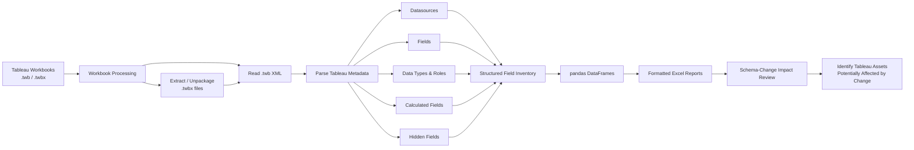

# Tableau Workbook Dependency Analyzer

**Recovering dependency visibility from an unmanaged Tableau environment before changing the underlying database schema.**

This project used Python to inspect Tableau `.twb` and `.twbx` workbooks, extract datasource and field metadata, and generate searchable Excel reports that helped database administrators and application teams identify downstream Tableau dependencies before making database changes.

The goal was straightforward: **make schema-impact analysis practical across a large collection of unmanaged Tableau workbooks so database changes were less likely to break dashboards unexpectedly.**

> **Project status:** This repository preserves the original implementation as a technical portfolio artifact from an enterprise analytics project. It is not currently maintained, packaged, or tested as a general-purpose Tableau utility. The source code is included to illustrate the approach used to solve the problem described below.

## Why I Built This

In a properly governed Tableau environment, published workbooks, ownership, versioning, and data dependencies can be managed centrally through Tableau Server. That wasn't the environment I encountered.

Over time, shared network drives had become a repository for hundreds of unmanaged and unversioned Tableau workbooks. Database engineers needed to modify and refactor schemas, but there was no reliable inventory showing which workbooks, datasources, fields, or calculations depended on the affected database objects.

Determining the impact required manual coordination between database engineers and dashboard developers—and depended heavily on people knowing where workbook files were stored, who owned them, and whether they were still in use.

I built Tableau XML Parse to analyze the underlying Tableau workbook XML directly, extract database and field dependencies, and turn that otherwise unmanaged collection of workbooks into something that could be searched and assessed programmatically.

The immediate goal was impact analysis: before changing a database schema, engineers could identify potentially affected Tableau assets and coordinate remediation with the appropriate dashboard owners.

More broadly, the project demonstrated how automation could recover useful dependency information from an analytics environment where normal governance, configuration management, and version control had broken down.

## What the Original Tool Did

The original implementation automated the process of:

1. Processing packaged (`.twbx`) and unpackaged (`.twb`) Tableau workbooks.
2. Extracting Tableau datasource and field metadata.
3. Capturing attributes such as:

   * field names
   * hidden status
   * field roles
   * data types
   * calculations
   * source workbook
4. Converting the extracted metadata into pandas DataFrames.
5. Generating formatted Excel reports that could be searched and reviewed during schema-impact analysis.

## Architecture / Data Flow



## Intended Workflow

```text
Database change proposed
        │
        ▼
Identify affected database fields
        │
        ▼
Search generated Tableau field inventory
        │
        ▼
Identify potentially affected workbooks,
datasources, fields, and calculations
        │
        ▼
Coordinate with dashboard owners
        │
        ▼
Review and remediate Tableau dependencies
        │
        ▼
Validate dashboards before deployment
```

The key benefit was not simply XML extraction. It was creating a practical coordination mechanism between database engineers and dashboard developers in an environment that lacked reliable centralized dependency management.

## Example Use Case

Suppose a database administrator needed to rename or remove a column in a reporting database.

In the environment this project addressed, hundreds of Tableau workbooks existed outside effective centralized governance. Without a dependency inventory, the database team could not reliably know which workbooks referenced the affected field or which developers needed to be involved.

The workflow allowed the team to:

1. Process the available Tableau workbook collection.
2. Generate an inventory of workbook field metadata.
3. Search that inventory for the database field being changed.
4. Identify workbooks, datasources, calculations, or other Tableau assets that might be affected.
5. Determine which dashboard owners needed to review their workbooks.
6. Update and validate those Tableau assets before the database change was deployed.

This shifted schema-impact analysis from largely manual discovery toward a repeatable, data-driven process.

## Original Project Structure

```text
├── main.py       # Workflow orchestration
├── tableau.py    # Tableau workbook parsing and field extraction
├── excel.py      # DataFrame conversion and Excel report generation
└── file.py       # File-system and workbook package handling
```

The repository contains the original source files for reference. They reflect the implementation created for the specific environment in which the project was developed rather than a maintained or packaged open-source application.

## Generated Excel Reports

The original reports contained field-level metadata such as:

| Information   | Purpose                                                    |
| ------------- | ---------------------------------------------------------- |
| Workbook      | Identified the Tableau workbook containing the field       |
| Datasource    | Identified the Tableau datasource                          |
| Field name    | Supported searches for fields affected by schema changes   |
| Hidden status | Indicated whether Tableau marked the field as hidden       |
| Role          | Captured Tableau field-role metadata                       |
| Data type     | Helped characterize the field and potential impact         |
| Calculation   | Exposed calculated-field expressions for dependency review |

Excel output was formatted to make large quantities of metadata easier to review, including column sizing, text wrapping for calculations, worksheet organization, and tab formatting.

## How This Supported Schema Changes

The extracted metadata helped answer questions such as:

* Which Tableau workbooks reference a database field that is being renamed or removed?
* Which calculated fields may depend on an affected field?
* Which Tableau datasources should be reviewed before a database migration?
* Which dashboard developers or application teams need to participate in the change?
* How broadly could a schema modification affect the Tableau reporting estate?

This was particularly useful because workbook dependencies were not reliably centralized, versioned, or documented, making manual inspection across hundreds of files impractical.

## Original Implementation

### `main.py`

Coordinated the overall workflow, including directory handling, workbook processing, parsing, and report generation.

### `tableau.py`

Contained the Tableau-specific parsing logic, including:

* `get_datasources()` — extracted datasource information from Tableau workbooks
* `extract_fields()` — parsed field metadata from datasources
* `process_workbooks()` — coordinated workbook processing and report generation

### `excel.py`

Handled transformation and reporting functions, including:

* `to_df()` — converted extracted field information to pandas DataFrames
* `to_excel()` — wrote DataFrames to Excel workbooks
* `summarize_excel()` — combined Excel output
* `colorize_and_format()` — formatted generated reports

### `file.py`

Handled file-system and workbook-package operations, including:

* `create_directory()` — created working directories
* `list_files()` — enumerated files by extension
* `list_tab_files()` — identified Tableau workbook files
* `unzip_packages()` — extracted `.twbx` packages
* `copy_unpackaged()` — handled unpackaged `.twb` files

## Design Approach

The project deliberately worked with Tableau's underlying XML rather than requiring every workbook to be opened manually.

That approach provided several advantages in the environment:

* **Scale** — hundreds of workbook files could be inspected programmatically.
* **Searchability** — extracted metadata could be consolidated into reports and searched by field or datasource.
* **Repeatability** — the same analysis could be repeated when new database changes were proposed.
* **Cross-team coordination** — database teams could identify potentially affected Tableau assets before involving dashboard owners.
* **Risk reduction** — dependencies could be investigated before a schema change reached production.
* **Governance recovery** — useful dependency information could be reconstructed even though the Tableau estate itself had not been consistently governed or versioned.

## Limitations

This project was developed for a specific enterprise environment and should be viewed in that context.

* Tableau workbook internals can vary by Tableau version and workbook structure.
* The parser was designed around workbook XML structures encountered in the original environment.
* Extracted metadata supported impact analysis but did not constitute a complete enterprise data-lineage system.
* A reported dependency still required human review before a production database change.
* The existence of a workbook on a network share did not necessarily establish that the workbook was active or still had an owner.
* The original implementation reflects the dependencies, conventions, and operating assumptions of the environment in which it was developed.
* The repository is preserved as a portfolio and technical reference artifact rather than maintained as installable software.

## What This Project Demonstrates

Although the implementation focused on Tableau XML parsing, the larger engineering problem was one of **governance, configuration management, dependency analysis, and operational risk**.

The project demonstrates an approach I have used repeatedly in enterprise environments:

1. Identify where missing governance or system visibility creates operational risk.
2. Determine what information can be recovered from existing technical artifacts.
3. Automate collection and normalization of that information.
4. Convert it into something operational teams can use to make safer decisions.
5. Use the resulting visibility to improve coordination across organizational boundaries.

In this case, parsing XML was the mechanism. The actual objective was giving database engineers and Tableau developers enough shared dependency information to change production systems with less risk.

## License

MIT License © 2023 Dave Rintoul
