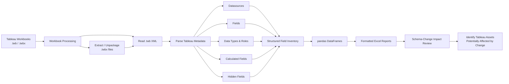

# Tableau Workbook Dependency Analyzer

**Analyze Tableau workbook dependencies before changing the underlying database schema.**

This Python tool inspects Tableau `.twb` and `.twbx` workbooks, extracts datasource and field metadata, and generates searchable Excel reports that help database administrators and application teams identify downstream Tableau dependencies before making database changes.

The goal is straightforward: **make schema-impact analysis practical across large collections of Tableau workbooks so database changes are less likely to break dashboards unexpectedly.**

## Why I Built This

I built this tool to solve a practical enterprise problem: database administrators needed to modify and refactor database schemas without having a reliable way to determine which Tableau workbooks depended on the fields being changed.

In an environment with hundreds of workbooks, manually opening each workbook and tracing its fields and calculations back to datasources was not realistic. Tableau workbook files contain much of this metadata in XML, so the process could be automated.

The analyzer extracts that metadata into structured Excel reports, giving engineering teams a searchable inventory they can use during database migrations, schema refactoring, column renames, and other changes that may affect downstream dashboards.

This is intended to **support dependency and impact analysis**. It does not guarantee that a database change is safe; teams should still validate affected workbooks and dashboards before deploying schema changes.

## What It Does

The tool automates the process of:

1. Processing packaged (`.twbx`) and unpackaged (`.twb`) Tableau workbooks.
2. Extracting Tableau datasource and field metadata.
3. Capturing attributes such as:
   - field names
   - hidden status
   - field roles
   - data types
   - calculations
   - source workbook
4. Converting the extracted metadata into pandas DataFrames.
5. Generating formatted Excel reports that can be searched and reviewed during schema-impact analysis.

## Architecture / Data Flow



### Intended Workflow

```text
Database change proposed
        │
        ▼
Identify affected database fields
        │
        ▼
Search generated Tableau field inventory
        │
        ▼
Identify potentially affected workbooks,
datasources, fields, and calculations
        │
        ▼
Review and remediate Tableau dependencies
        │
        ▼
Validate dashboards before deployment
```

## Example Use Case

Suppose a database administrator wants to rename or remove a column used by a reporting database.

Without a dependency inventory, the team may not know which Tableau workbooks reference that field until dashboards fail after the change.

With this tool, the team can:

1. Process the Tableau workbook collection.
2. Generate a consolidated inventory of workbook field metadata.
3. Search the reports for the field being changed.
4. Identify workbooks, datasources, or calculations that may require review.
5. Update and validate those Tableau assets before the database change is deployed.

## Project Structure

```text
├── main.py       # Main execution and workflow orchestration
├── tableau.py    # Tableau workbook parsing and field extraction
├── excel.py      # DataFrame conversion and Excel report generation
└── file.py       # File-system and workbook package handling
```

## Requirements

- Python 3.x
- pandas
- openpyxl
- `xml.etree.ElementTree` (Python standard library)

## Installation

Clone the repository:

```bash
git clone https://github.com/drintoul/tableau-xml-parse.git
cd tableau-xml-parse
```

Install the required Python packages:

```bash
pip install pandas openpyxl
```

## Usage

1. Create a directory named `Packaged`.
2. Place the Tableau `.twb` and/or `.twbx` workbooks you want to analyze in that directory.
3. Run:

```bash
python main.py
```

The script will:

- create `Unpackaged` and `Fields` directories as needed
- extract packaged Tableau workbooks
- process the available workbook XML
- extract datasource and field metadata
- generate Excel reports containing the extracted information

## Generated Excel Reports

The reports include field-level metadata such as:

| Information | Purpose |
|---|---|
| Workbook | Identifies the Tableau workbook containing the field |
| Datasource | Identifies the Tableau datasource |
| Field name | Supports searches for fields affected by schema changes |
| Hidden status | Indicates whether Tableau marks the field as hidden |
| Role | Captures Tableau field-role metadata |
| Data type | Helps characterize the field and potential impact |
| Calculation | Exposes calculated-field expressions for dependency review |

Excel output is also formatted for easier review, including column sizing, text wrapping for calculations, sheet organization, and tab formatting.

## How This Supports Schema Changes

The extracted workbook metadata can help answer questions such as:

- Which Tableau workbooks reference a field that is being renamed?
- Which calculated fields may depend on a field being removed?
- Which Tableau datasources should be reviewed before a database migration?
- How broadly could a schema change affect the Tableau reporting estate?

The tool is particularly useful when Tableau workbook dependencies are not centrally versioned or documented and manual inspection would be impractical.

## Functions

### `main.py`

Coordinates the overall process, including directory creation, workbook handling, parsing, and report generation.

### `tableau.py`

- `get_datasources()` — extracts datasource information from Tableau workbooks
- `extract_fields()` — parses field metadata from datasources
- `process_workbooks()` — coordinates workbook processing and report generation

### `excel.py`

- `to_df()` — converts extracted field data to pandas DataFrames
- `to_excel()` — writes DataFrames to Excel workbooks
- `summarize_excel()` — combines Excel output
- `colorize_and_format()` — formats generated reports

### `file.py`

- `create_directory()` — creates required directories
- `list_files()` — enumerates files by extension
- `list_tab_files()` — finds Tableau workbook files
- `unzip_packages()` — extracts `.twbx` packages
- `copy_unpackaged()` — handles unpackaged `.twb` files

## Error Handling

The current implementation includes exception handling around:

- directory operations
- workbook/file processing
- XML parsing
- Excel generation

Errors are reported so that a problem with an individual file does not silently pass unnoticed.

## Limitations

- Tableau workbook internals can vary by Tableau version and workbook structure.
- The parser assumes workbook XML follows structures understood by the current implementation.
- The reports expose workbook metadata useful for impact analysis; they are not a complete enterprise lineage engine.
- A reported dependency should be reviewed and validated before a production schema change.
- The current implementation truncates generated Excel worksheet names to 25 characters.
- The process requires appropriate file-system permissions for directory creation and output generation.

## Possible Future Improvements

- Add automated tests using representative `.twb` and `.twbx` fixtures.
- Add CI with GitHub Actions.
- Package dependencies in `pyproject.toml` or `requirements.txt`.
- Add a command-line interface for configurable input and output paths.
- Add explicit database-table and physical-column lineage where Tableau metadata makes that relationship available.
- Add machine-readable CSV or JSON output in addition to Excel.
- Add optional validation against published Tableau workbook schemas.
- Produce a consolidated cross-workbook dependency report for large Tableau estates.

## Contributing

Issues and pull requests are welcome.

If you encounter a Tableau workbook structure the parser does not handle correctly, a minimal sanitized example is especially useful for improving compatibility.

## License

MIT License © 2023 Dave Rintoul
